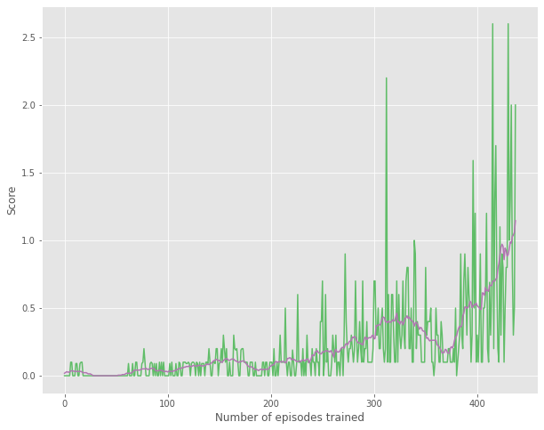

# Report

## Learning Algorithm
We implement the Multi-Agent DDPG (MADDPG) algorithm as described in _Rowe et al., 2017_ to solve the Udacity version of
the Unity Tennis environment. This algorithm extends DDPG into a multi-agent policy gradient algorithm where
decentralized agents learn a centralized critic based on the observations and actions of all agents. The pseudocode
for the algorithm that has been implemented is shown below.

[Source](https://arxiv.org/pdf/1706.02275v4.pdf)

The following sections describes the implementation in more detail and the results from the experiment.

### Model architecture
MADDPG approach follows a "centralized training with decentralized execution" strategy.

We train one agent per player. Each agent has its own actor network. The input to the actor network
has 24 dimensions. The first hidden layer is fully-connected and consists of 512 rectifier units. The
second hidden layer is also fully-connected and consists of 256 rectifier units. The output layer for
the actor network is a fully-connected layer with two output Tanh units for each of the action dimension.

The agent also has a Q-network/critic network that uses combined state action pairs of both agents to
estimate Q-values. The input to this network has dimension of 54 (2x states + 2x actions). The first hidden
layer is fully-connected and consists of 512 rectifier units. The second hidden layer is also fully-connected
and consists of 256 rectifier units. The output layer for the Q-network is a fully-connected linear layer
with a single output unit that yields the Q value estimate for the given joint state-action pair for the agents.

The critic network interacts with the actor network by sending its Q-value approximations to the actor network
for training. Note that the Q-value network has full visibility of all agents states and actions while the
actor network only knows its agent's state and actions. Leveraging a centralized Q-value estimate leads to
agents choosing action that can be system optimum rather than local player optimum.

Target networks with identical architectures are used for both the actor and the critic in order to stabilize
training. The target network is updated once per main network update by polyak averaging.

The data for training the agent is stored in an experience replay buffer. At each timestep, the agents store
their states, actions, rewards and their next states to this buffer and at training time, a batch of these
transitions from the experience replay is sampled to train the agents.

To make DDPG policies explore better, we add noise to the actions generated by the actor at training time. This
is done by simply perturbing the action proposed by the actor with time-correlated
[OU noise](https://en.wikipedia.org/wiki/Ornstein–Uhlenbeck_process) as suggested in _Lillicrap et al. 2016_.

### Training details
In all of our experiments, we use the Adam optimizer with a learning rate of 5e-4 and
τ = 0.01 for updating the target networks. The values and description of all the hyper-parameters
are provided in the table below.

**Table:** List of hyper-parameters and their values

Hyperparameter | Value | Description
------------ | ------------- | -------------
gamma | 0.99 | Discount factor used for DDPG update
tau | 0.01 | Update factor for polyak update of target network weights
update_freq | 1 | Number of env steps between updates
update_passes | 5 | Number of passes to run when updating
lrate_actor | 5e-4 | Learning rate for the actor network
lrate_critic | 5e-4 | Learning rate for the critic network
batch_size | 128 | Number of training cases over which each SGD update is computed
buffer_size | 1000000 | Data for SGD update is sampled from this number of most recent experiences

The values of all the hyper-parameters were picked based on an informal assessment of performance and is likely not the optimal set of parameters.

In the next section, we discuss the results of the experiment.

### Evaluation procedure
Score for each episode is calculated as the maximum reward accumulated across the two agents.
The key evaluation metric that is tracked is this score collected by the agents over 100 episodes. The environment is considered solved when the agents gets an average score of +0.5
over 100 consecutive episodes.

### Results
The plot below shows the training curves tracking the evaluation metric outlined above. Each point is the average (smoothed) score achieved per episode after the agent is run. The smoothing is performed
over a 10 episode smoothing window.

We make the following observations from the plot:
* The training of the PPO agent is stable as illustrated by the increasing average score over the training timeline
* The agent is able to reach a score 30.04 (> the target average score of 30) in 163 episodes.

## Ideas for future work
* We did not perform a systematic hyper-parameter tuning exercise to arrive at an optimal set of hyper-parameter. While
the computational cost may be high for a comprehensive parameter sweep, it is very likely that we can train better
agents when using more tuned parameters.
* We have only implemented one algorithm here. It would be interesting to compare other approaches that have shown
  promise for continuous control such as DDPG (_Timothy et al. 2015_) and Soft Actor-Critic (_Haarnoja et al. 2018_).

## Code availability.
The source code can be accessed at https://github.com/nsriram13/rl-collaboration-and-competition.

## References
* Haarnoja, Tuomas, et al. Soft Actor-Critic: Off-Policy Maximum Entropy Deep Reinforcement Learning with a Stochastic Actor. Jan. 2018. arxiv.org, https://arxiv.org/abs/1801.01290v2.
* Lillicrap, Timothy P., et al. Continuous Control with Deep Reinforcement Learning. Sept. 2015. arxiv.org, https://arxiv.org/abs/1509.02971v6.
* Saxe, Andrew M., et al. Exact Solutions to the Nonlinear Dynamics of Learning in Deep Linear Neural Networks. Dec. 2013. arxiv.org, https://arxiv.org/abs/1312.6120v3.
* Schulman, John, Philipp Moritz, et al. High-Dimensional Continuous Control Using Generalized Advantage Estimation. June 2015. arxiv.org, https://arxiv.org/abs/1506.02438v6.
* Schulman, John, Filip Wolski, et al. Proximal Policy Optimization Algorithms. July 2017. arxiv.org, https://arxiv.org/abs/1707.06347v2.

## Acknowledgements
It would not have been possible to implement this algorithm correctly without the help
from the many great implementations of PPO that are made available in the open source
by the RL community. We would like to reference the following implementations and thank
the authors for making these valuable resources available online for free:
* [DeepRL](https://github.com/ShangtongZhang/DeepRL) by Shangtong Zhang
* [ReAgent](https://github.com/facebookresearch/ReAgent/blob/master/reagent/training/ppo_trainer.py) from Facebook Research
* [Spinning Up](https://github.com/openai/spinningup/blob/master/spinup/algos/pytorch/ppo/ppo.py) from OpenAI
